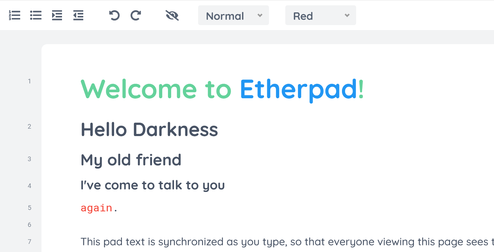

 
# Section headings for Etherpad

An Etherpad Plugin to apply h1 etc. headings to a pad.

## Features

- [x] Test coverage
- [x] Linted
- [x] i18n (translations)
- [x] Import/export support
- [x] Copy/paste support
- [x] Shows active Heading
- [x] Maintained by the Etherpad Foundation

## Copyright and License

Copyright the ep_headings2 authors and contributors.

Licensed under the [Apache License, Version 2.0](LICENSE) (the "License"); you
may not use this file except in compliance with the License. You may obtain a
copy of the License at

http://www.apache.org/licenses/LICENSE-2.0

Unless required by applicable law or agreed to in writing, software distributed
under the License is distributed on an "AS IS" BASIS, WITHOUT WARRANTIES OR
CONDITIONS OF ANY KIND, either express or implied. See the License for the
specific language governing permissions and limitations under the License.
