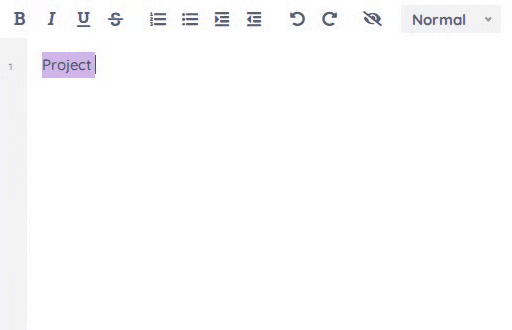

 
# Section headings for Etherpad

An Etherpad Plugin to apply h1 etc. headings to a pad.



## Features

- [x] Test coverage
- [x] Linted
- [x] i18n (translations)
- [x] Import/export support
- [x] Copy/paste support
- [x] Shows active Heading
- [x] Maintained by the Etherpad Foundation

## Installation

Install from the Etherpad admin UI (**Admin → Manage Plugins**,
search for `ep_headings2` and click *Install*), or from the Etherpad
root directory:

```sh
pnpm run plugins install ep_headings2
```

> ⚠️ Don't run `npm i` / `npm install` yourself from the Etherpad
> source tree — Etherpad tracks installed plugins through its own
> plugin-manager, and hand-editing `package.json` can leave the
> server unable to start.

After installing, restart Etherpad.

## Configuration

Font sizes can be customized in `settings.json` under the `ep_headings2` key:

```json
"ep_headings2": {
  "fontSizes": {
    "h1": "2.5em",
    "h2": "1.8em",
    "h3": "1.5em",
    "h4": "1.2em"
  }
}
```

Any omitted heading level falls back to its default value.  The same font
sizes are applied both in the editor and in exported documents.

## Copyright and License

Copyright the ep_headings2 authors and contributors.

Licensed under the [Apache License, Version 2.0](LICENSE) (the "License"); you
may not use this file except in compliance with the License. You may obtain a
copy of the License at

http://www.apache.org/licenses/LICENSE-2.0

Unless required by applicable law or agreed to in writing, software distributed
under the License is distributed on an "AS IS" BASIS, WITHOUT WARRANTIES OR
CONDITIONS OF ANY KIND, either express or implied. See the License for the
specific language governing permissions and limitations under the License.
